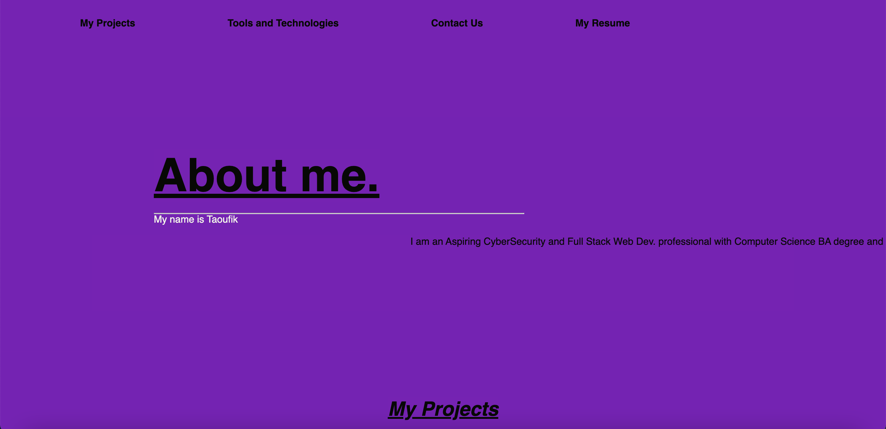
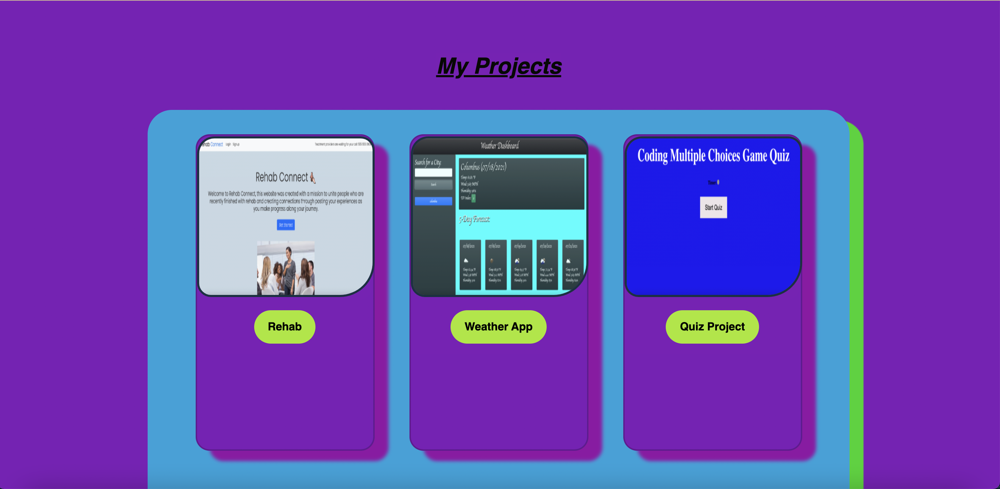
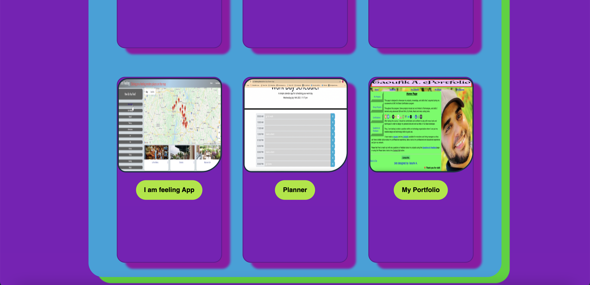
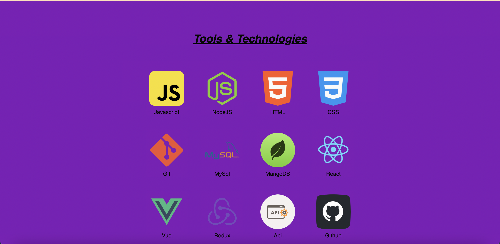
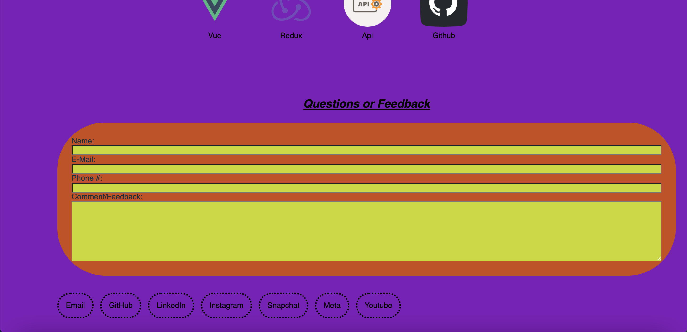

<h1 align="center">My React Portfolio</h1> 


## Summary
This portfolio is the result of my continues hard work and sleepless nights to learn and master most tools that were covered in this course. This porfolio is a showcase my personal porjects that I worked on during this course using React JS which implements a single page thru the whole site.
Throughout this portfolio, Some projects that I worked on include but are not limited to Technologies, and skills I learned using advanced CSS and Html, JS, Node, React and many coding tools.

#
#
## Table of Contents
- [Portfolio](#Portfolio)
- [LinkedIn](#Linkedin)
- [License](#license)
- [Challenges](#challenges)
- [Technologies](#technologies)
- [Link](#link)

#
#
## Screenshots







<br>
<br>

						


#
#
## License
[](https://opensource.org/licenses/MIT)


#
#

## Challenges
There are many challenges that i faced working on this project. However, I was able to overcome most of them either by searching online and by asking for help. 
The main challenge I faced was formatting and styling the elements within the site. 
The other main challenge I faced was debugging and cleaning the code after I finished working on the site.

#
#
## Technologies

		  
		
		  
		  
		  
		  
		

		  
		  
			
			
			
			  
				
        
<br><br>
#
#


## Link 
This is the live URL/link to My [Portfolio](https://lbladma.github.io/React-Portfolio/).


 #
 #

## My LinkedIn
This is My LinkedIn page

 <a href="https://www.linkedin.com/in/taoufika/" target="_blank">
  
 <p> </p>
 <a></a><br>


#
#
#


 #
 #
  #
 #
#
 #
#
 #


# Homework Description outline. 
# 20 React: React Portfolio

## Your Task

Being a web developer means being part of a community. You’ll need a place not only to share your projects while you're applying for jobs or working as a freelancer but also to share your work with other developers and collaborate on projects.

Your task is to create a portfolio using your new React skills, which will help set you apart from other developers whose portfolios don’t use the latest technologies. 

You’ll deploy this application to GitHub Pages. Follow the instructions in the Git Guide or consult the 
[Create React App Docs on GitHub Pages](https://create-react-app.dev/docs/deployment/#github-pages) to create a build that you can deploy.

**Important:** Be sure to push your codebase to the default branch in GitHub -- NOT your built and deployed code. Ensure this happens by using the `gh-pages` branch to host the deployed application's build.

## User Story

```md
AS AN employer looking for candidates with experience building single-page applications
I WANT to view a potential employee's deployed React portfolio of work samples
SO THAT I can assess whether they're a good candidate for an open position
```

## Acceptance Criteria

```md
GIVEN a single-page application portfolio for a web developer
WHEN I load the portfolio
THEN I am presented with a page containing a header, a section for content, and a footer
WHEN I view the header
THEN I am presented with the developer's name and navigation with titles corresponding to different sections of the portfolio
WHEN I view the navigation titles
THEN I am presented with the titles About Me, Portfolio, Contact, and Resume, and the title corresponding to the current section is highlighted
WHEN I click on a navigation title
THEN I am presented with the corresponding section below the navigation without the page reloading and that title is highlighted
WHEN I load the portfolio the first time
THEN the About Me title and section are selected by default
WHEN I am presented with the About Me section
THEN I see a recent photo or avatar of the developer and a short bio about them
WHEN I am presented with the Portfolio section
THEN I see titled images of six of the developer’s applications with links to both the deployed applications and the corresponding GitHub repositories
WHEN I am presented with the Contact section
THEN I see a contact form with fields for a name, an email address, and a message
WHEN I move my cursor out of one of the form fields without entering text
THEN I receive a notification that this field is required
WHEN I enter text into the email address field
THEN I receive a notification if I have entered an invalid email address
WHEN I am presented with the Resume section
THEN I see a link to a downloadable resume and a list of the developer’s proficiencies
WHEN I view the footer
THEN I am presented with text or icon links to the developer’s GitHub and LinkedIn profiles, and their profile on a third platform (Stack Overflow, Twitter)
```

## Mock-Up

The following animation shows the web application's appearance and functionality:


## Getting Started

You’ll use `create-react-app` to build your portfolio, which will include the following:

* A single `Header` component that appears on multiple pages

* A single `Navigation` component within the header that will be used to conditionally render the different sections of your portfolio

* A single `Project` component that will be used multiple times in the Portfolio section

* A single `Footer` component that appears on multiple pages

**Note:** Because this application doesn’t include a back end or connect to an API, the contact form doesn't need to save this information right now. You'll add back-end functionality in the next few weeks. In the meantime, consider including your email address and phone number on the Contact page.

### Projects

For each project that is featured in your portfolio, include the following:

* An image of the deployed application (either a short animated GIF or screenshot)

* The title of the project

* A link to the deployed application

* A link to the corresponding GitHub repository

### Design

As with the previous portfolio homework, remember that "good" design is subjective; however, your site should look polished. Here are a few guidelines on what that means:

* Use mobile-first design.

* Choose a color palette that distinguishes your site from the default Bootstrap theme and unstyled HTML sites. Refer to resources like [Coolors](https://coolors.co/) or another color scheme generator to help you create something that will stand out.

* Ensure that the font size is large enough to read and that the colors don't cause eye strain.

* Consider using animations and React component libraries. Note that this will not affect your grade, but it might impact how potential employers gauge your knowledge.

## Grading Requirements

This homework is graded based on the following criteria:

### Technical Acceptance Criteria: 40%

* Satisfies all of the preceding acceptance criteria plus the following:

    * Application must use React to render content.

    * Application has a single `Header` component that appears on multiple pages, with a `Navigation` component within it that’s used to conditionally render About Me, Portfolio, Contact, and Resume sections.

    * Application has a single `Project` component that’s used multiple times in the Portfolio section.

    * Application has a single `Footer` component that appears on multiple pages.

    * Application must be deployed to GitHub Pages.

### Deployment: 32%

* Application deployed at live URL.

* Application loads with no errors.

* Application GitHub URL submitted.

* GitHub repository contains application code.

### Application Quality: 15%

* User experience is intuitive and easy to navigate.

* User interface style is clean and polished.

* Application uses a color scheme other than the default Bootstrap color palette.

### Repository Quality: 13%

* Repository has a unique name.

* Repository follows best practices for file structure and naming conventions.

* Repository follows best practices for class/id naming conventions, indentation, quality comments, etc.

* Repository contains multiple descriptive commit messages.

* Repository contains high-quality README file with description, screenshot, and link to deployed application.

## Review

You are required to submit BOTH of the following for review:

* The URL of the functional, deployed application.

* The URL of the GitHub repository, with a unique name and a README that describes the project.

- - -
© 2021 Trilogy Education Services, a 2U, Inc. brand. All Rights Reserved.
